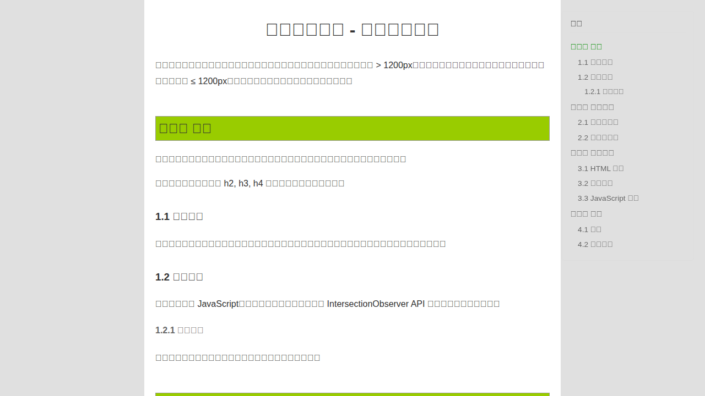
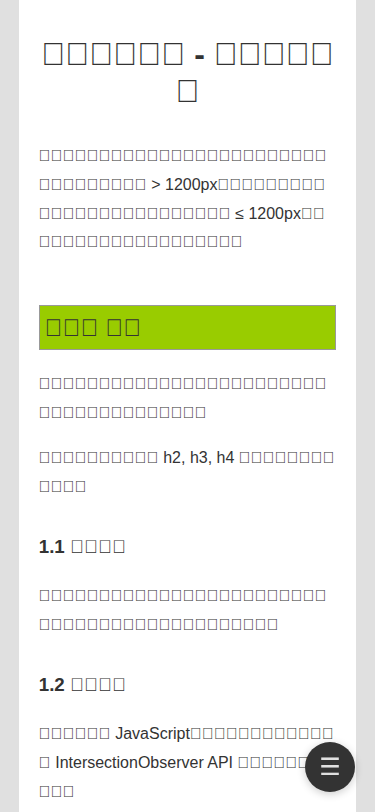
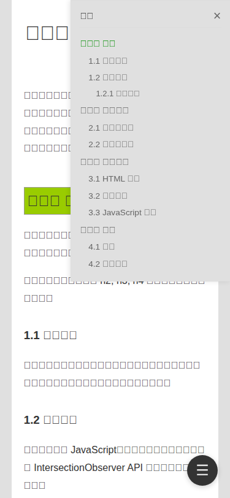

# 博客大纲视图功能演示

这个文件夹包含了博客大纲视图（TOC）功能的演示截图和示例页面。

## 📸 效果截图

### 1. 桌面端视图 (desktop-view.png)


**特点：**
- 右侧固定显示目录栏（240px 宽）
- 自动从文章的 h2、h3、h4 标题生成目录
- 当前阅读章节高亮显示（绿色）
- 层级缩进清晰，便于导航
- 目录区域可独立滚动

---

### 2. 移动端视图 - 关闭状态 (mobile-closed.png)


**特点：**
- 目录默认隐藏，不占用屏幕空间
- 右下角显示圆形汉堡菜单按钮（☰）
- 点击按钮可以打开目录

---

### 3. 移动端视图 - 打开状态 (mobile-open.png)


**特点：**
- 目录从右侧平滑滑入
- 全高度显示，覆盖在内容上方
- 右上角有关闭按钮（×）
- 点击任何链接或外部区域自动关闭
- 支持滚动查看完整目录

---

## 🎯 功能说明

### 响应式设计
- **桌面端（> 1200px）**：目录固定在右侧，始终可见
- **移动端（≤ 1200px）**：目录通过按钮控制显示/隐藏

### 主要特性
1. ✅ 自动生成：从文章标题自动提取生成目录
2. ✅ 层级显示：h2、h3、h4 标题分级缩进
3. ✅ 当前高亮：滚动时自动高亮当前阅读章节
4. ✅ 平滑滚动：点击目录链接平滑跳转到对应位置
5. ✅ 移动友好：移动端通过按钮控制，体验流畅

### 技术实现
- 纯 JavaScript 实现，无第三方依赖
- 使用 IntersectionObserver API 实现滚动高亮
- CSS 过渡动画实现平滑的展开/收起效果
- 最小化改动，只修改了 4 个文件

---

## 📁 文件说明

- `demo.html` - 完整的演示页面，可以在浏览器中直接打开查看效果
- `desktop-view.png` - 桌面端效果截图
- `mobile-closed.png` - 移动端关闭状态截图
- `mobile-open.png` - 移动端打开状态截图
- `README.md` - 本说明文件

---

## 🚀 如何查看

### 方法1：直接查看截图
直接在这个文件夹中查看 PNG 图片文件。

### 方法2：在浏览器中打开演示页面
```bash
# 启动一个简单的 HTTP 服务器
cd demo-screenshots
python3 -m http.server 8000

# 然后在浏览器中访问
# http://localhost:8000/demo.html
```

### 方法3：在实际博客中查看
功能已经集成到博客中，任何包含 h2、h3 或 h4 标题的文章页面都会自动显示大纲视图。

---

## 📝 代码修改说明

实现这个功能只修改了 4 个文件：

1. **_layouts/post.html** - 添加了 TOC 的 HTML 结构
2. **_sass/toc.scss** - 新增，定义了 TOC 的样式
3. **_sass/app.scss** - 导入 toc.scss
4. **assets/javascripts/app.js** - 添加了 initTOC 函数

总共增加了约 263 行代码，改动最小化，不影响现有功能。
